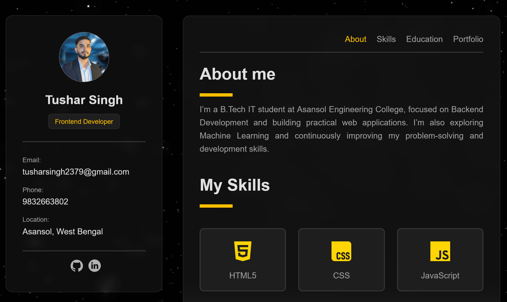

# Personal Portfolio

My personal portfolio website built from scratch using HTML and CSS.

🌐 **Live Demo:** https://tushars1ngh.github.io/tushar-portfolio1/

## 📸 Preview



## About

This is my first frontend project, built while learning HTML and CSS.

I created this portfolio to practice what I was learning and to have a place where I can showcase my skills, education, projects, and contact information.

While building it, I learned a lot about structuring a real website, creating layouts, making pages responsive, working with CSS, using Git and GitHub, and deploying a website using GitHub Pages.

This project is mainly a learning project, and I plan to keep improving it as I learn more.

## 🛠️ Technologies Used

- HTML5
- CSS3
- Flexbox
- CSS Grid
- Media Queries
- Git
- GitHub
- GitHub Pages

## ✨ Features

- Responsive portfolio layout
- About Me section
- Skills section
- Education section
- Portfolio / Projects section
- Contact information
- GitHub and LinkedIn links
- Responsive navigation
- CSS hover effects and transitions
- Dark-themed design
- Mobile-friendly layout

## 📚 What I Learned

Building this project helped me understand how different parts of a website work together.

Some of the main things I learned were:

- Writing and structuring HTML
- Using semantic HTML elements
- Styling elements with CSS
- Working with Flexbox
- Creating layouts using CSS Grid
- Understanding `margin`, `padding`, `width`, and `height`
- Using `position` and `sticky` elements
- Creating responsive layouts with media queries
- Understanding `max-width` and responsive breakpoints
- Making layouts work on different screen sizes
- Using relative paths for images and other files
- Adding hover effects and CSS transitions
- Organizing project files
- Using Git for version control
- Creating and managing a GitHub repository
- Making commits with meaningful messages
- Deploying a static website using GitHub Pages

## 📁 Project Structure

```text
tushar-portfolio/
│
├── index.html
├── styler.css
│
├── css.png
├── git.png
├── github.png
├── html5.png
├── javascript.png
├── linkedin.png
├── portfoliome.png
├── scikitlearn.png
├── tusharpfp.png
├── videoplayback.mp4
│
└── README.md
```

## 🚀 Run Locally

This is a simple HTML and CSS project, so no framework, package manager, or backend setup is required.

### 1. Clone the repository

```bash
git clone https://github.com/tushars1ngh/tushar-portfolio.git
```

### 2. Open the project

```bash
cd tushar-portfolio
```

Open the project in VS Code and open `index.html` in your browser.

You can also use the **Live Server** extension in VS Code for local development.

## 🌐 Deployment

The portfolio is deployed using **GitHub Pages**.

**Live Website:**

https://tushars1ngh.github.io/tushar-portfolio/

The source code is available in this repository, and the deployed version can be accessed through the link above.

## 🎯 Purpose

The main purpose of this project was to:

- Apply the HTML and CSS concepts I was learning
- Build something from scratch instead of following only tutorials
- Understand how a complete frontend project is structured
- Practice responsive web design
- Learn how to use Git and GitHub
- Learn how to deploy a website
- Create a portfolio that I can continue improving

## 🔄 Future Improvements

As I continue learning frontend development, I plan to improve this portfolio by adding new features, improving the UI and responsiveness, and updating the projects and skills section.

## 👤 Author

**Tushar Singh**

B.Tech IT Student  
Asansol Engineering College

- GitHub: https://github.com/tushars1ngh
- LinkedIn: https://www.linkedin.com/in/1tusharsingh/

## 📄 License

This project is created for learning and personal portfolio purposes.
